# Mikayla Forte - Frontend UI

---

## Contents
1. [Introduction](#introduction)
2. [Challenges](#challenges)
3. [Revised Wireframe](#revised-wireframe)
4. [Annotated Screenshots](#annotated-screenshots)
5. [User Stories](#user-stories)
6. [Testing](#testing)
   
## Introduction
## Challenges
-muddling up code and not referencing
- I wasnt able to have dark mode toggle with implementing JS, so I disabled the button. In hindsight, I should have removed the button altogether. 
- I wasnt able to get my forms required fields to work. only on the profile, could I have the broswer use its own required but without a working button, it was not successful. 
-submit button

## Revised Wireframe
### Home Page

## Annotated Screenshots

## User Stories
## Testing
### HTMl Validator 
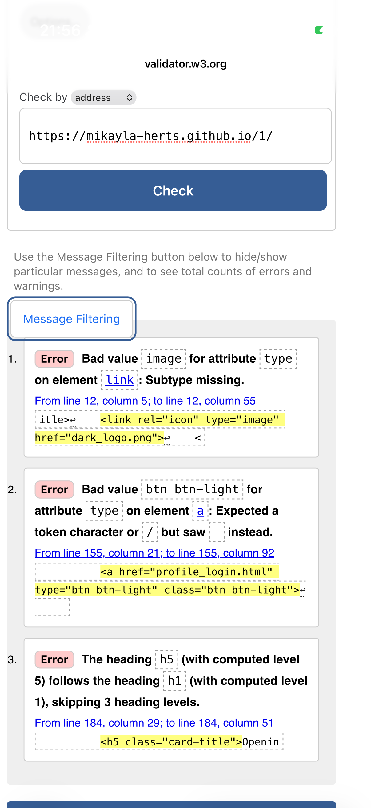
### CSS Validator 
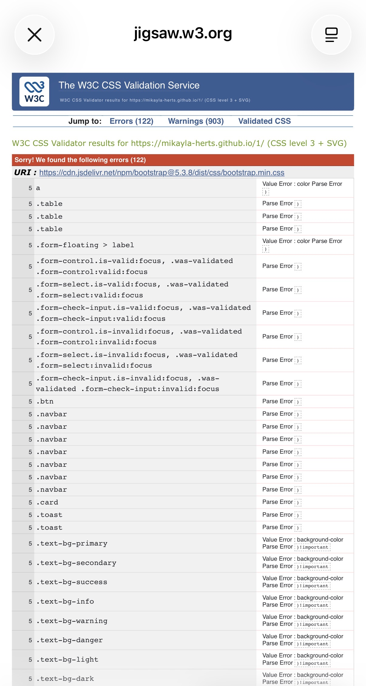
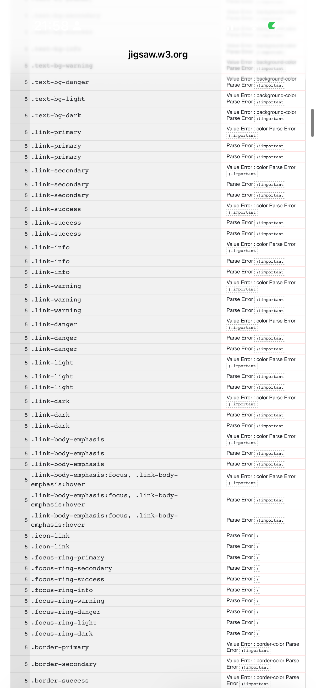
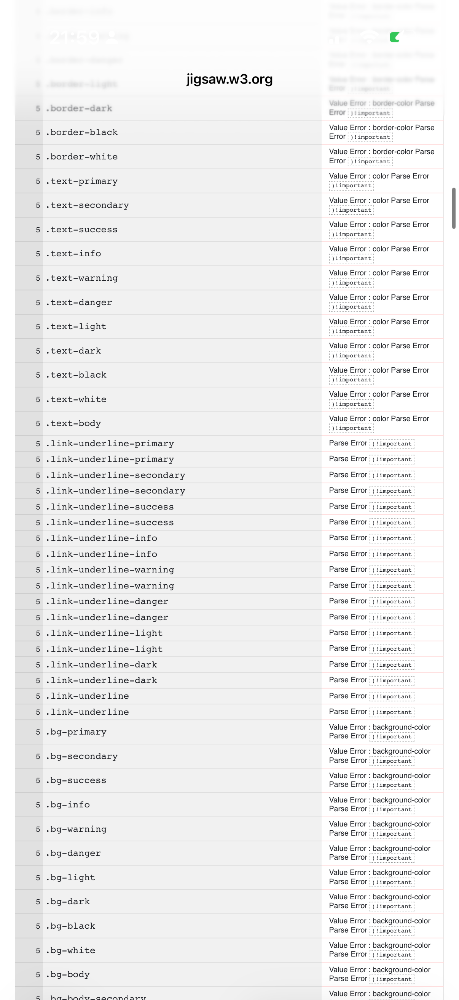
### Google Lighthouse  
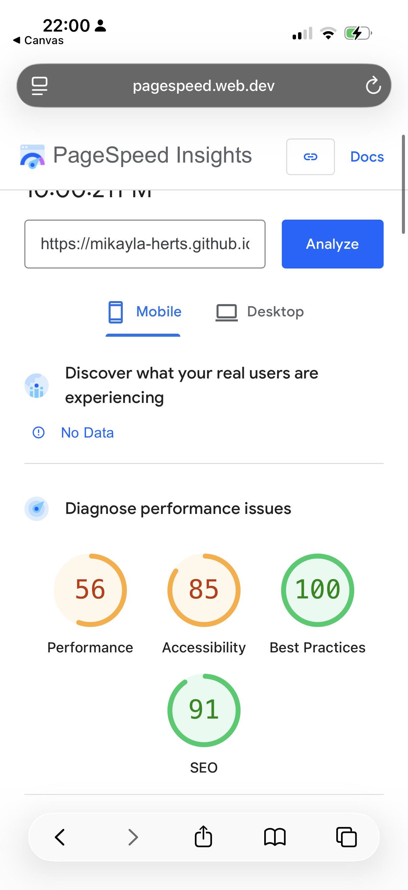
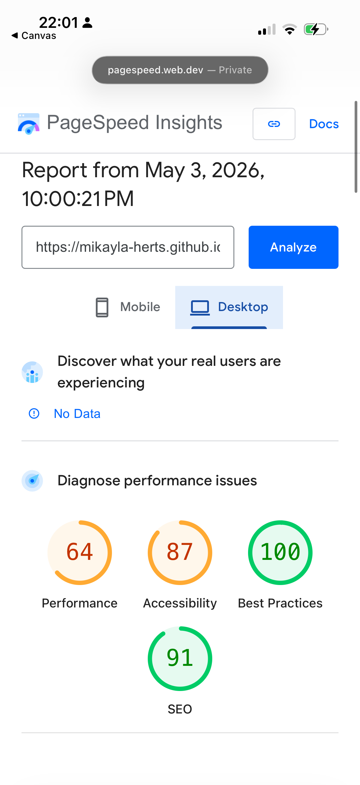
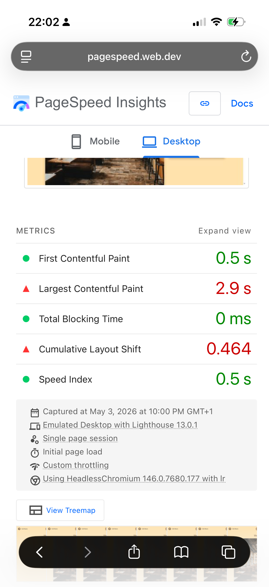
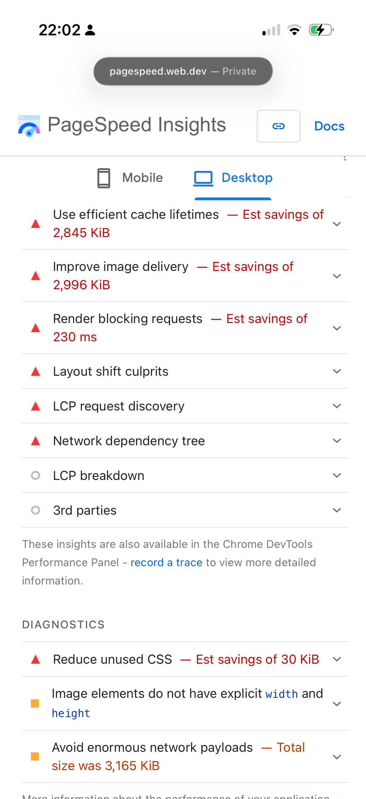
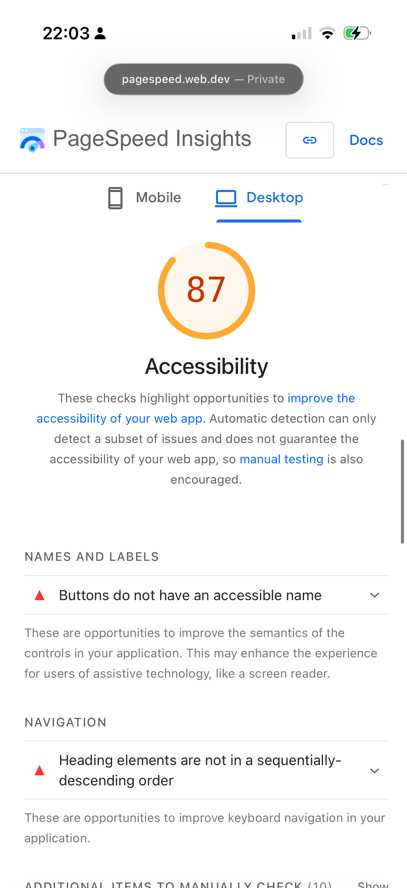
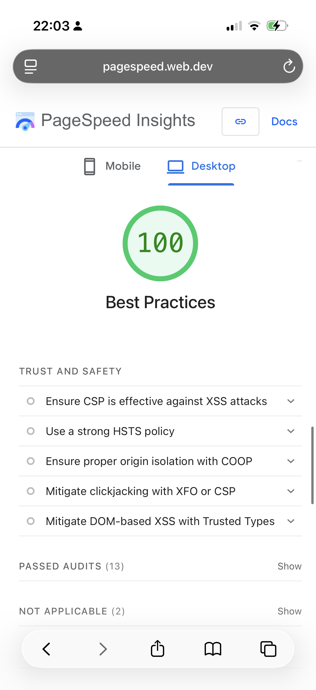
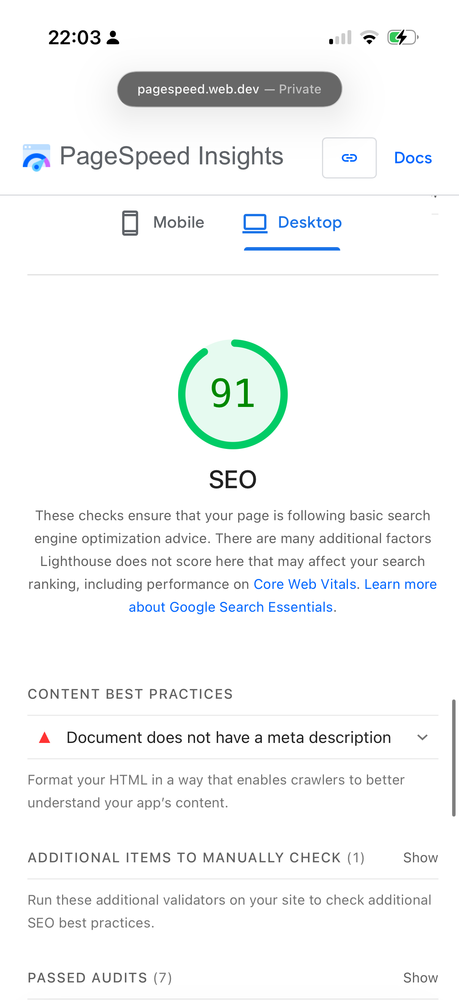
